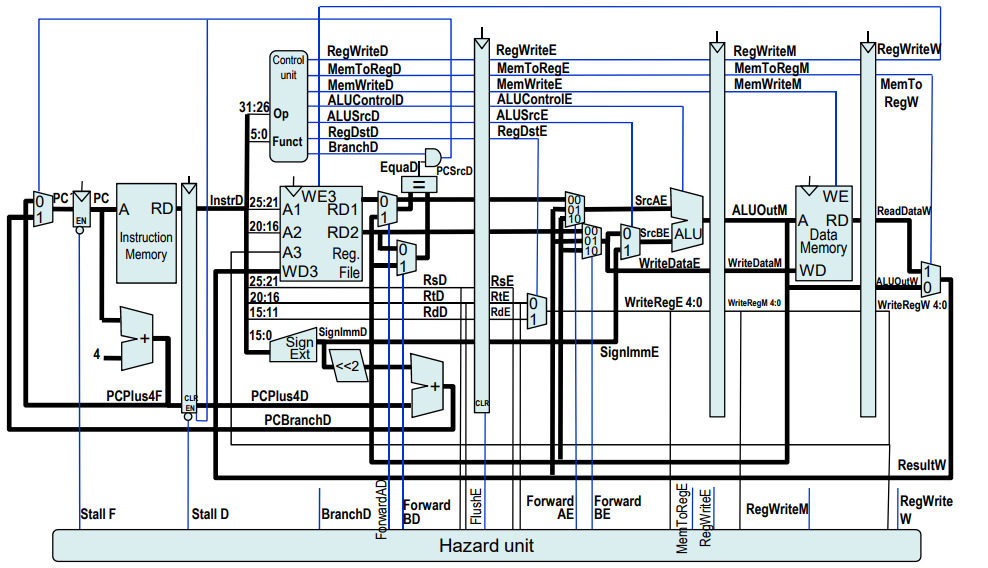

# MIPS-pipeline-processor

This repository contains the Verilog implementation of a 5-stage pipelined processor based on the 32-bit MIPS architecture based on limited ISA. The processor design includes five pipeline stages: Instruction Fetch (IF), Instruction Decode (ID), Execution (EX), Memory Access (MEM), and Write Back (WB).

## Pipeline Stages
The processor is divided into five pipeline stages, which execute instructions concurrently to improve performance. The stages are as follows:

### 1. Instruction Fetch (IF): 
Fetches the instruction from the instruction memory based on the program counter (PC) value.
### 2. Instruction Decode (ID): 
Decodes the fetched instruction, reads the required registers from the register file, and determines the next PC value.
### 3. Execution (EX): 
Performs arithmetic and logical operations based on the decoded instruction and the values from the register file. It also calculates memory addresses for load/store instructions.
### 4. Memory Access (MEM): 
Performs memory operations, such as loading data from memory or storing data into memory.
### 5. Write Back (WB): 
Writes the results of the execution back to the register file.  
<br>

## Diagram depicting the various components:<br><br>

This image is taken from the web to provide a better view of the implementation.

## Getting Started

Download or clone the project, write your machine code to run in the `input.txt` file present in the assembler directory. Now, run the `assembler.cpp` file that converts it into the required input format for the processor and writes it in `instructionMemory.v` present in the same directory. Now, copy this file and paste it in processor directory.
To run the processor you can use any software of your choice with similar instructions. The instructions for iverlog (assuming linux environment or WSL and directory as the processor directory of the folder) are as follows:

```iverilog -o outputFileName ALU.v instructionDecode.v IDtoExe.v exeToMemReg.v instructionExecution.v  programCounter.v IFtoIDReg.v instructionFetch.v registerFile.v instructionMemory.v controlUnit.v memToWBReg.v writeBack.v dataMemory.v  memory.v finalTestBench.v toplevel.v```

```vvp outputFileName```

Furthermore, the waveform of the output can be viewed using gtkwave as

```gtkwave .\testbench.vcd```

### Instruction format

Each instruction is 32 bits long. Therefore, each instruction takes up four memory cells, as shown bellow.


```
instMem[0] <= 8'b10000000;
instMem[1] <= 8'b00100000;
instMem[2] <= 8'b00000000;
instMem[3] <= 8'b00001010;
```


### Module naming convention

To maintain conformity, the microProcessor is divided into many smaller modules. Most module names follow the format {unitName} or{previousUnitName}+to+{nextUnitName}.
